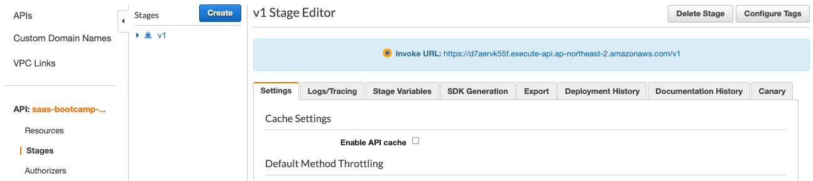
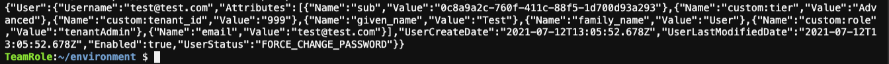

# Lab 1 – Tenant Onboarding

### Overview

이 첫 번째 실습에서는 테넌트를 SaaS 시스템에 온 보딩하는 데 필요한 사항을 살펴 보겠습니다. 여러 측면에서 **온보딩은 SaaS의 가장 중요한 요소 가운데 하나입니다.** 온보딩 과정에서 앞으로 SaaS 서비스가 어떻게 테넌트를 식별하고, 이 식별된 테넌트를 SaaS 아키텍처의 각 요소(서비스, 리소스)에 적용할 지 결정 하게 됩니다.

또한 이것을 바탕으로 궁극적으로 **SaaS 서비스 안에서 이 식별된 테넌트를 바탕으로 논리적 혹은 물리적인 격리(isolation)을 달성할 수 있습니다.**

SaaS 서비스 온보딩의 핵심 부분은 **SaaS Identity**를 만드는 겁니다. SaaS Identity란 쉽게 말해 **_User Identity에 Tenant라는 개념을 binding 한 것입니다. 즉 User가 Tenant로 치환되는 과정에서 만들어진 일종의 tenant identity 인 셈이죠_**. 저희는 이를 종종 Tenant Context 라고 표현 하기도 합니다. 그런데 많은 시스템들이 User Identity 따로, Tenant identity 만드는 과정 따로 함으로써 시스템 오버 헤드와 복잡성을 더 하고 있습니다. 이렇게 하기 보다 **User 와 테넌트를 한번에 묶어 SaaS Identity를 만들어 자연스럽게 SaaS 시스템을 구성하는 다양한 서비스에 주입 하는 방법이 좋은 아키텍처 관점에서 나은 접근 입니다.** 저희는 바로 이 부분을 실습을 통해 살펴 볼겁니다.

저희는 먼저 Identity Provider에 의해 User Identity가 어떻게 만들어지는 살펴 볼 겁니다. Identity Provide 로 **Amazon Cognito**를 사용할 것이며, 이를 통해 사용자 인증과 SaaS 솔루션을 위한 온보딩 흐름을 어떻게 만들 수 있는지 살펴 볼겁니다. 그리고 이 때, Cognito에 custom attribute라는 것을 설정 하여 User와 테넌트를 연결 하고, 그 결과 Tenant Context가 포함된 Token이 만들어지는 과정을 살펴볼 것 입니다.

실습 1이 끝나면 테넌트와 테넌트의 사용자를 온보드하고 인증할 모든 요소를 갖추게 됩니다. 아래 다이어그램은 이러한 환경을 지원하는 데 필요한 핵심 서비스 모듈을 보여 줍니다.(\*이 모듈은 실습을 위해 이미 만들어져 제공 되며, 실습 과정에서 일부 코드 변경이 실습 과정에 포함 됨)

<p align="center"></p>

다이어그램의 최 상단 에는 온보딩 및 인증 흐름을 위한 사용자 인터페이스를 제공하는 웹 애플리케이션이 있습니다. 이는 API Gateway를 통해 마이크로 서비스에 연결됩니다. API Gateway 아래에는 이러한 흐름을 지원하는 데 필요한 다양한 마이크로 서비스가 있습니다. Tenant Registration 모듈은 온보딩 프로세스의 오케스트레이터로, User Manager (**Amazon Cognito**에서 사용자 생성) 및 Tenant Manager (테넌트 생성)를 호출합니다. Authentication Manager는 User Manager 모듈을 통해 사용자를 인증합니다.

### 실습에서 만드는 것들

실습 1 에서 여러분은 다음과 같은 작업들을 통해 SaaS 온보딩과 인증 체계를 구현해 볼겁니다.

- <span style="color:blue">**User Identity 생성과 관리**</span>: 이를 위해 여러분은 사용자를 관리하고 User identity를 다루기 위해 Amazon Cognito로 부터 User Pool 을 사용할 겁니다. 이를 위해 Amazon Cognito 환경을 셋업 하고 이를 활용하는 User Management 모듈의 마이크로서비스를 배포할 겁니다.
- <span style="color:blue">**User 생성과 관리**</span>: Amazon Cognito API를 사용한 User 관련 마이크로서비스를 실행하여 User를 생성하고 관리하는 부분을 살펴 볼 겁니다. 이를 위해 직접 이 마이크로 서비스를 호출해 볼겁니다.
- <span style="color:blue">**Tenant 생성과 관리**</span>: Tenant 관리 마이크로서비스를 통해 테넌트 관련 데이터를 어떻게 관리 하는지 살펴볼 겁니다. 이를 위해 직접 이 마이크로 서비스를 호출해 볼겁니다.
- <span style="color:blue">**온보딩**</span>: 샘플 SaaS 애플리케이션으로 새 테넌트와 이 테넌트의 admin 사용자를 등록 합니다. 이를 통해 Amazon Cognito가 인증 흐름을 어떻게 관리하는지 파악할 수 있습니다. 또한 admin 아닌 사용자를 동일한 테넌트에 추가하여 특정 기능에 대한 접근 제한을 어떻게 달성 하는지 살펴볼 겁니다. 마지막으로 tenant 정보가 포함된 JWT를 직접 확인해볼 겁니다.

## Part 1 - User Identity 생성과 관리

이번 파트의 목표는 사용자를 가입, 관리, 인증하는데 사용되는 Amazon Cognito를 직접 손으로 셋업 해보면서, 사용자 온보딩, 관리, 인증의 흐름을 이해하는데 있습니다. 또한 이 과정에서 사용자를 테넌트와 연결하여 SaaS Identity를 생성할 수 있도록 하는 기능도 만들어 볼겁니다.

이번 Bootcamp 에서 사용하는 샘플 SaaS 애플리케이션은, 각 테넌트 마다 고유한 Cognito User Pool을 갖습니다. 그리고 이 각각의 user pool은 테넌트의 온보딩 과정에서 자동으로 만들어질 겁니다.

**Step 1** - AWS Console 에서 Amazon Cognito 로 이동한 다음 **"Manage User Pools"**을 선택 합니다.

<p align="center"></p>

**Step 2** -Cognito 화면 우측 상단에서 "**Create A User Pool**"을 선택 합니다.

<p align="center"></p>

**Step 3** – User pool을 생성할 수 있는 화면을 볼수 있습니다. 먼저 pool에 이름을 지정 합니다. 여러분이 원하는 이름(예, "**SaaS Bootcamp Users**")을 사용합니다.

<p align="center"></p>

**Step 4** - "**Step through settings**" 을 선택하세요. 여기서 여러분은 SaaS 사용자의 온보딩을 위한 설정을 user pool에 할겁니다.

먼저 user pool의 속성 정보를 설정 할 수 있습니다. 아래 화면과 같이 Sign in 관련 설정을 해주어야 합니다. "**Also allow sign in with a verified phone number**"을 옵션으로 선택 합니다.

<p align="center"></p>

**Step 5** – 이제 user pool의 표준 속성 값을 설정 하는 단계로 이동 합니다. 여기서 **email**, **family name**, **given name**, **phone number**, and **preferred username** 속성을 선택 합니다. (\*이런 속성들은 보통 OIDC 표준 claim들 입니다.)

<p align="center"></p>

**Step 6** – 자 이제 좀더 SaaS 관점의 설정을 할 차례 입니다. 이를 위해 custom attribute를 설정 합니다. 위에서 언급한 바와 같이, 이것을 이용해 사용자를 tenant에 연결 하는 겁니다. 이를 통해 SaaS 서비스가 테넌트를 만들 때 이 custom attributes에 담긴 추가적인 정보를 사용자 프로필에 추가할 수 있게 됩니다. 그리고 이 정보들은 인증 프로세스 과정에서 반환 되는 Token에도 포함될겁니다.

페이지를 스크롤 다운하고 **Add custom attributes**를 클릭합니다.

<p align="center"></p>

다음의 테넌트 속성을 추가 합니다.(**\*Add another attribute를 눌러 추가 합니다**)

- **tenant_id** (string, default max length, _**not**_ mutable)
- **tier** (string, default max length, mutable)
- **company_name** (string, default max length, mutable)
- **role** (string, default max length, mutable)
- **account_name** (string, default max length, mutable)

<p align="center"></p>

**Step 7** – custom attribute 설정을 완료 하고, 화면 하단의 "**Next step**"을 클릭 합니다. 그러면 비밀 번호 설정과 연관된 정책 설정 화면으로 이동 됩니다. 여기서 설정 하는 정책들은 테넌트 각각에 대해 별로 만들수 도 있습니다. 따라서 만약 테넌트 별로 고유한 정책 설정이 필요한 경우 이를 활용 하면 됩니다.

일단 실습을 위해, 몇 가지 기본 값을 덮어쓸 겁니다. 먼저 "**Require special character**" 옵션을 해제 합니다. 또한 "**Only allow administrators to create users**" 옵션을 선택해 시스템에서 새로운 사용자를 생성 할 수 있는 권한을 제한 합니다. 설정이 모두 완료 되었다면 페이지 하단의 "**Next step**" 버튼을 누릅니다.

<p align="center"></p>

**Step 8** - 이번에는 MFA 인증에 관한 설정 화면입니다. 실습의 목적상 이 부분은 **기본값 그대로** 유지 하겠습니다. 그리고 **"Next step" 버튼을 클릭하세요**

**Step 9** - 다음은 **Message customizations** 페이지 입니다.온보딩 과정에서 사용자에게 그들의 idenity 확인을 위한 이메일을 보낼 겁니다. 이걸 Cognito에서 제공하는 기능을 활용해 만들 수 있습니다. "**Do you want to customize your user invitation messages?**" 섹션 으로 스크롤다운 합니다. 그리고 새로운 테넌트 가입 과정에서 Cognito에 의해 발송되는 이메일을 입맛에 맞게 아래와 같이 변경 합니다.

이메일 제목을 "Your temporay password" 에서 "**New SaaS Bootcamp Tenant**" 로 변경 하고 **Email message** 텍스트를 아래 코드로 변경 합니다.

```html

<br /><br />
Welcome to the SaaS on AWS Bootcamp. <br /><br />
Login to the SaaS system. <br /><br />
Username: {username} <br /><br />
Password: {####}.
```

<p align="center"></p>

그리고 "**Next step**" 버튼을 누릅니다.

**Step 10** - 추가 적인 설정 작업 없이 **App clients** 화면으로 이동 하기 위해 "**Next step**"을 두 차례 클릭 합니다.

**Step 11** – 이제 User pool의 기본 사항을 만들었으므로 이 풀에 대한 애플리케이션 클라이언트를 만들어야합니다. "**Add an app client**"를 선택 합니다.

<p align="center"></p>

**Step 12** – 이제 새 애플리케이션 클라이언트를 구성 할 수 있습니다. "SaaS App Client"을 이름으로 입력하고 "**Generate client secret**" 상자의 선택을 취소 합니다. 그리고 그 외의 expiration 설정 값은 기본 값을 그대로 둡니다.

그리고 **Auth Flows Configuration** 설정 부분에서 마지막 기본 값으로 선택된 항목을 제외한 나머지 항목의 선택을 모두 취소 합니다.

그리고 그 외의 항목은 기본 값 그대로 둡니다. 최종 설정 모습은 다음과 같습니다.

<p align="center"></p>

이제 "**Create app client**" 버튼을 선택한 다음 "**Next step**"버튼을 선택합니다.

**Step 13** – 이번 실습에서는 **Triggers** 섹션을 _건너 뜁니다_. 화면 하단으로 스크롤하고 "**Next step**" 버튼을 클릭하여 최종 검토 화면으로 이동 한 다음 "**Create pool**"을 클릭합니다.

**Step 14** – 성공적으로 user pool 이 생성 되었다면, **General Settings** 화면에서 **Pool id** 값을 복사하여 따로 메모 합니다. 또한 왼쪽 목록에서 **App clients** 탭을 선택하고 **App client id** 역시 따로 메모 해둡니다. 이 두 값은 다음 단계에서이 사용합니다.

<p align="center"></p>

<p align="center"></p>

**Step 15** - 앞서 User pool 설정이 완료되었습니다. 이제 이 User pool을 사용하려면 먼저 User pool을 **indentity pool**과 연결 해야합니다. Identity pool은 많은 자격 증명 공급자의 자격 증명과 통합할 수 있는 기능을 제공 하고 AWS 리소스에 대한 액세스를 관리합니다. Identity pool을 설정하려면 왼쪽 상단의 AWS 아이콘을 선택한 다음 서비스 목록에서 Cognito를 다시 선택하여 Cognito의 기본 페이지로 돌아갑니다. 여기에서 "**Manage Identity Pools**"버튼을 선택합니다.

<p align="center"></p>

**Step 16** – 새 Identity pool 의 이름을 **SaaS Identity Pool** 이라고 입력 합니다.

**Step 17** – "**Authentication Providers**"섹션의 삼각형을 클릭하여 확장합니다. 여기에서 User pool과 Identity pool 간의 연결을 생성 할겁니다. Cognito가 지원하는 다양한 자격 증명 공급자를 나타내는 탭 이 보일 겁니다. 우리는 첫 번째 탭인 Cognito를 자격 증명 공급자로 사용 할겁니다. "**User Pool ID**"와 "**App client id**"에 위 단계에서 따로 기록해둔 pool id, App Client id값들로 채웁니다.

<p align="center"></p>

**Step 18** "**Create Pool**"을 클릭 합니다.

**Step 19** – 마지막으로, 다음 페이지에서 "**Allow button**"을 선택해 새로운 identity pool이 AWS 자원에 접근 할 수 있도록 활성화 합니다.

**Recap** : 여기까지, SaaS 시스템이 사용자를 관리하고 해당 사용자를 테넌트와 연결 하는데 필요한 부분을 만들었습니다. 또한 온보딩 중에 시스템이 사용자를 확인하고 제어 하는 ​​정책을 설정했습니다. 그리고 나서 마지막 단계에, 인증을 활성화하고 AWS 리소스에 액세스 할 수 있도록 identity pool을 설정 했습니다.

## Part 2 - Managing Users

User Identity 관리를 지원하기 위해 Cognito를 생성 했습니다만, 애플리케이션이 이러한 시스템 요소에 액세스하고 구성을 할 수 있도록하는 몇 가지 장치가 여전히 필요합니다. 즉 애플리케이션이 Amazon Conginto API를 사용해 user 를 관리할 수 있는 마이크로 서비스 모듈을 만들어 앞선 과정을 자동화해야 합니다.

이 마이크로서비스를 처음 부터 만들기 보다는 실습을 위해 **Amazon Elastic Container Service** (ECS)에 이미 배포된 코드를 사용 하겠습니다.

**Note**: 본 문서에서 참고 하는 코드는 다음 리파지토리에서 확인 할 수 있습니다: https://github.com/aws-samples/aws-saas-factory-bootcamp

**Step 1** – AWS Console에서 Cloud9을 선택하십시오. 사용 가능한 IDE가 나열 됩니다. **SAASBOOTCAMPIDE** 타일에서 **Open IDE** 버튼을 클릭하여 Cloud9을 시작합니다.

<p align="center"></p>

**Step 2** – 코드를 살펴 보겠습니다. Cloud9 IDE가 시작되면 이 실습 GitHub 저장소가 자동으로 복제되어 왼쪽 폴더 트리에 `aws-saas-factory-bootcamp` 폴더 표시 될겁니다. 이 폴더에서 `source/user-manager` 폴더로 이동합니다. **server.js** 파일을 두 번 클릭하여 편집기 창에서 엽니다. 이 파일은 **Express** 웹 애플리케이션 프레임 워크를 사용하여 사용자 관리를위한 REST API를 구현하는 **Node.js** 파일입니다. 아래 목록은 온보딩 과정에 관여하는 Entry point 목록 입니다.

```javascript
app.get('/user/pool/:id', function(req, res) {...});
app.get('/user/:id', function(req, res) {...});
app.get('/users', function(req, res) {...});
app.post('/user/reg', function(req, res) {...});
app.post('/user/create', function(req, res) {...});
app.post('/user', function(req, res) {...});
app.put('/user', function(req, res) {...});
app.delete('/user/:id', function(req, res) {...});
```

이것들은 User Manager 서비스의 진입 점을 나타내며 User pool 등록 및 조희를 지원하는 기능 외에도 기본적인 CRUD 작업을 포함합니다.

**Step 3** – 사용자를 Cognito에 유지하는 User Manager 서비스의 POST 메서드를 자세히 살펴 보겠습니다. Cognito가 사용자를 저장하는 저장소 역할을 하므로 User Manager 서비스는 Cognito API를 호출하여 시스템에서 생성 된 새 사용자를 유지해야합니다. `app.post` 메서드가 request body 에서 JSON 형식의 사용자 객체를 가져온 다음 SDK 가 제공하는 Cognito API의 `createUser` 메서드를 통해 Cognito User pool로 전달하는 것을 볼 수 있습니다.

```javascript
app.post("/user/create", function (req, res) {
  var newUser = req.body;

  var credentials = {};
  tokenManager.getSystemCredentials(function (systemCredentials) {
    if (systemCredentials) {
      credentials = systemCredentials;

      cognitoUsers.createUser(
        credentials,
        newUser,
        function (err, cognitoUsers) {
          if (err) {
            res.status(400).send('{"Error": "Error creating new user"}');
          } else {
            res.status(200).send(cognitoUsers);
          }
        }
      );
    } else {
      res
        .status(400)
        .send('{"Error": "Could not retrieve system credentials"}');
    }
  });
});
```

**Step 4** – 코드 동작 흐름을 살펴 봤으므로 이제 동작 하는 모습을 살펴보겠습니다. 이를 위해 이 REST API를 직접 호출하여, 테넌트 용으로 생성 한 **Cognito User Pool**에 사용자를 생성 해 보겠습니다.

이를 위해서는 실습을 위해 배포된 마이크로 서비스와 연결된 **API Gateway**의 **Inovke IRL**과 identity pool을 생성 할 때 이전에 메모해둔 Cognito의 **Pool Id**가 필요합니다.

AWS 콘솔에서 **API Gateway** 콘솔로 이동합니다. API 목록 가운데 **saas-bootcamp-api**를 선택합니다. 그리고 이어서, 좌측 네비게이션에서 **Stages**를 선택하고 바로 오른편에 나타나는 v1을 선택 합니다. 그러면 아래 화면 처럼 **Invoke ULR**이 파란색으로 하이라이트 되어 나타 납니다.

<p align="center"></p>

**Step 5** – User pool ID를 다시 검색해야 하는 경우 AWS 콘솔에서 Cognito 서비스로 이동하여 **Manage User Pools** 버튼을 선택합니다. 계정에서 생성 된 User pool 목록이 표시됩니다.

<p align="center"></p>

**Step 6** – 앞선 과정에서 생성한 Pool 을 선택하면 User pool의 속성을 식별하는 요약 페이지가 표시됩니다. 여기서 필요한 데이터는 페이지 상단에 표시되는 **Pool Id**입니다 (아래에 표시된 것과 유사).

<p align="center"></p>

**Step 7** – 이제 **Invoke URL**과, **Pool Id**를 갖고 Cognito를 호출해 새로운 사용자를 생성해 보겠습니다. 사용자 생성 POST 메서드를 호출을 위해 연결된 REST entry point를 호출 합니다. 이를 위해 다양한 도구 (cURL, Postman 등)를 통해이 작업을 수행 할 수 있습니다만, 간단하게 Cloud9 터미널에서 cURL을 사용하겠습니다.

Cloud9 에서 녹색 더하기 버튼을 클릭하고 **New Terminal**을 선택하여 새 터미널 창을 열거 나 키보드 단축키 `Alt / Opt-T`를 사용할 수 있습니다.

<p align="center"></p>

터미널 창에 다음 명령을 복사하여 붙여 넣습니다. (스크롤하여 전체 명령을 선택해야 함). 이때 **USER-POOL-ID**를 **_메모해둔 Cognito user pool id_**로 **INVOKE-URL**을 **_API Gateway Stage API에서 확인한 URL_**로 변경 합니다. 그리고 나서 이를 실행 합니다.

```bash
curl -w "\n" --header "Content-Type: application/json" --request POST --data '{"userPoolId": "USER-POOL-ID", "tenant_id": "999", "userName": "test@test.com", "email": "test@test.com", "firstName": "Test", "lastName": "User", "role": "tenantAdmin", "tier": "Advanced"}' INVOKE-URL/user/create
```

호출이 성공되면 아래와 같이 새롭게 생성된 사용자 객체가 JSON 포맷으로 반환 될겁니다.

<p align="center"></p>

**Step 8** – Cognito User pool 에 새로운 사용자가 생성되었는지 확인 하겠습니다. 다시 한 번 AWS 콘솔의 Cognito 서비스로 돌아 갑니다. **Manager User Pools**을 선택하고 위에서 만든 User pool인 **"SaaS Bootcamp users**"를 선택 합니다.

왼쪽 메뉴에서 **User and groups**을 선택합니다. 이 옵션을 선택하면 pool의 사용자 목록이 표시됩니다.

<p align="center"></p>

**Step 9** – 목록에서 Username에 포함된 링크를 눌러 자세한 정보를 확인 합니다. cURL을 이용한 REST API 호출을 통해 생성한 사용자 정보(이메일, 테넌트 이름)가 생성되었음을 확인할 수 있습니다. Username 컬럼의 test@test.com 값을 선택해 봅니다. 그럼 아래와 같이 추가된 User의 상세 정보가 확인 됩니다.

<p align="center"></p>

**Recap**: Part2 에서는 Cognito API를 활용해 User Manager 서비스를 어떻게 구현 했는지 살펴 봤습니다. 또한 이 서비스를 간단하게 cURL로 호출해 동작하는 모습도 살펴 봤습니다. 이를 통해 저희는 User Manager 서비스가 Cognito user pool에 새로운 사용자를 생성하는 흐름을 이해할 수 있었습니다. <span style="color:blue">물론 이번 파트에서는 user pool 생성과, 이 안에 User를 추가 하는 작업을 수작업으로 테스트 해봤지만, **이어지는 파트에서는 테넌트 별 user pool 생성과 생성된 user pool에 새로운 사용자를 생성하는 온보딩 전체 과정을 자동화 할겁니다.**</span>

## Part 3 - Managing Tenants

앞선 과정을 통해 온보딩 프로세스의 일부로 Cognito를 활용해 사용자를 생성하는 방법을 마련 했습니다. 또한 custom attribute 를 설정해 사용자를 테넌트와 연결하는 방법도 미리 마련 했습니다. 그런데 한 가지 빠진 부분은 테넌트 정보를 저장하는 장치 입니다.

테넌트는 사용자와 별도로 관리 되어야합니다. 테넌트들은 모두 자신만의 Policy,Tiering,Status 등을 가지고 있습니다. 이번 파트에서는 이를 DynamoDB 테이블에 저장하는 장치를 만들어 보겠습니다.

**Step 1** – Tenant Manager 서비스도 ECS Fargate 컨테이너에 Node.js 마이크로 서비스로 배포되어 있습니다. 또한 REST API로 노출 되어있어 User Manager Service에서 와 마찬가지로 curl을 통해 실행할 수 도 있습니다.

다음 명령을 실행하여 새로운 테넌트를 만들어 보겠습니다. 아래 명령을 복사하여 **Cloud9에서 열어둔 Terminal 창**에 붙여 넣으세요.(스크롤하여 전체 명령을 선택해야 함). 이때 **INVOKE-URL**을 API Gateway Stages API에서 확인한 값으로 바꿔줍니다.

```bash
curl -w "\n" --header "Content-Type: application/json" --request POST --data '{"tenant_id": "111", "role": "tenantAdmin", "company_name": "Test SaaS Tenant", "tier": "Advanced", "status": "Active"}' INVOKE-URL/tenant
```

curl 호출이 성공 했다면 `{"status":"success"}`라는 결과가 리턴 됩니다.

**Step 2** – 테넌트가 데이터베이스에 저장되었는지 확인하겠습니다. AWS 콘솔에서 DynamoDB 서비스로 이동하고 페이지 왼쪽 상단의 탐색 목록에서 **Tables** 옵션을 선택합니다.

<p align="center"></p>

**Step 3** – DynamoDB 테이블 목록에서 **TenantBootcamp** 테이블 하이퍼링크를 찾아 선택한 다음 **Items** 탭을 선택하여 테이블의 데이터를 살펴봅니다. 앞서 curl로 호출한 /tenant 생성 요청의 생성된 `"tenant_id": "111"`이 확인 됩니다.

<p align="center"></p>

**Recap**: Part3의 목표는 User 데이터와 테넌트의 고유한 속성 데이터를 분리함으로써 테넌트를 관리하고 명확한 방법을 마련 하는것 이었습니다. 이를 위하여, ​​Tenant Manager라는 테넌트 관리 서비스를 도입하고, 이를 통해 DynamoDB에 테넌트 데이터를 별도로 관리하는 과정을 살펴 봤습니다. 참고로 앞으로 DynamoDB 테이블에 생성되는 **tenat_id**는 이전 파트에서 **custom attribute** 로 추가 한 **tenant_id**를 통해 연결되어 생성 될겁니다.

## Part 4 - The Onboarding & Authentication Application

Part4 에서는 온보딩 프로세스를 지원하기 위한 모든 마이크로 서비스가 배포되고 백엔드 인프라 부분이 배포 됩니다. 그리고 테넌트를 온보딩하고 인증하기 위한 서비스 모듈을 실습용 SaaS 애플리케이션을 동작 해보며 살펴볼 겁니다.(\*이 애플리케이션은 **Amazon S3**에서 호스팅되는 비교적 간단한 AngularJS 애플리케이션입니다.)

**Step 1** – SaaS 웹 애플리케이션을 동작 해보기 전에 위에서 설명한 REST 서비스를 호출 할 UI 코드의 샘플을 살펴 보겠습니다. 다음 코드는`source/web-client/app/scripts/controllers/register.js`에 있는 컨트롤러에서 가져온 것입니다. registration 양식을 작성하고 사용자가 **Register** 버튼을 선택하면 시스템이 아래 코드를 호출합니다:

```javascript
$scope.formSubmit = function () {
  if (!($scope.tenant.email || $scope.tenant.companyName)) {
    $scope.error =
      "User name and company name are required. Please enter these values.";
  } else {
    var tenant = {
      id: "",
      companyName: $scope.tenant.companyName,
      accountName: $scope.tenant.companyName,
      ownerName: $scope.tenant.email,
      tier: $scope.tenant.plan,
      email: $scope.tenant.email,
      userName: $scope.tenant.email,
      firstName: $scope.tenant.firstName,
      lastName: $scope.tenant.lastName,
    };

    $http
      .post(Constants.TENANT_REGISTRATION_URL + "/reg", tenant)
      .then(function (data) {
        console.log("Registration success");
        $scope.hideRegistrationForm = true;
        $scope.showSuccessMessage = true;
      })
      .catch(function (response) {
        $scope.error = "Unable to create new account";
        console.log("Registration failed: ", response);
      });
  }
};
```

주목할 점은 register form에서 새 테넌트의 모든 속성(company name, email, name, etc)을 추출하여 JSON 형태의 `tenant`객체에 담습니다. 그런 다음이 JSON 테넌트 데이터를 tenant registration 서비스에 POST 하는 REST 호출을 만듭니다. 그런 다음이 tenant registration 서비스 는 User Manager 및 Tenant Manager 서비스를 호출하여 이 테넌트만을 위한 공간의 모든 요소를 ​​프로비저닝합니다.

**Step 2** – 저희가 사용할 Angular 웹 애플리케이션은 **Amazon S3** 를 통해 호스팅 됩니다. 하지만 웹사이트 로딩과 HTTPS encryption offloading 을 위해 S3 전면에 **CloudFront** 를 배치 햇습니다. 따라서 이 웹 애플리케이션에 접근/동작을 확인하려면 **CloudFront**에서 애플리케이션의 URL을 확인해야 합니다.

AWS 콘솔에서 **CloudFront** 서비스로 이동합니다. 아래와 같은 조회 화면에서 Domain Name에 표시된 주소를 복사 합니다.

<p align="center"></p>

**Step 3** – 애플리케이션의 랜딩 페이지가 표시되며 로그인하라는 메시지가 표시됩니다. 이 페이지는 이미 등록한 테넌트를 위한 페이지입니다. 저희는 아직 등록된 테넌가 없으므로 **Register** 버튼 (**Login** 버튼 오른쪽에 있음)을 선택해야합니다. 이 버튼을 선택하면 새 테넌트를 등록 할 수있는 페이지로 이동합니다.

<p align="center"></p>

새 테넌트에 대한 데이터를 입력 하세요. 여기서 키 값은 이메일 주소입니다. 여기에 "Plan" 값은 이 테넌트가 사용할 Tiering을 고르는 용도 입니다. 양식을 작성한 후 **Register** 버튼을 클릭하면 신원을 확인하기 위한 이메일을 보냈다는 메시지가 표시됩니다.

> **주의**: 새로운 테넌트 등록이 완료되면 이메일로 신원 확인 메일이 발송 됩니다. 따라서 이 메일 확인이 가능한 유효한 이메일 주소를 사용해야 합니다.

**Step 4** - 테넌트 등록에 사용한 이메일 수신함으로 이동해 메일을 확인 합니다. 아래 화면과 같은 신원 확인 메일을 확인할 수 있을 겁니다:

<p align="center"></p>

**Step 5** - 신원 확인 메일에 포함된 임시 비밀번호와, Username을 갖고 **Login** 합니다.

<p align="center"></p>

**Step 6** - 임시 비밀번호가 아닌 새로운 비밀 번호 생성 화면이 나타날겁니다. 원하는 비밀 번호를 입력하고 **Confirm** 버튼을 클릭 합니다. 이 모든 과정은 Cognito를 통해서 동작 합니다.(\*비밀번호는 8개 이상의 대소문자 그리고 최소 1개 이상의 숫자가 포함되어야 합니다)

<p align="center"></p>

**Step 7** - 이제 새롭게 생성된 계정과 비밀번호로 인증되었는지 확인해보겠습니다. email 주소와 새로 변경한 비밀번호를 입력 합니다. 그러면 인증에 성공하면 아래와 같은 SaaS 웹 애플리케이션의 랜딩 페이지로 입장 할겁니다.

<p align="center"></p>

**Step 8** – 새로 생성된 테넌트는 **Tenant Administrator**로 생성됩니다. 이를 통해 테넌트 환경을 완전히 제어 할 수 있습니다. 또한 시스템에서 새 User를 생성 할 수있는 권한도 갖습니다. 한번 확인해 보겠습니다. 페이지 상단의 **Users** 메뉴 옵션으로 이동합니다. 시스템의 현재 사용자 목록이 표시됩니다.(\*Administrator 사용자만 확인될 겁니다.)

<p align="center"></p>

이제 **Add User** 버튼을 선택하여 **Order Manager** 역할로 시스템에 새 사용자를 추가합니다. 테넌트와 다른 이메일 주소/사용자 이름을 사용하여 새 사용자를 만듭니다. 모든 데이터를 입력했으면 양식 하단의 **Save** 버튼을 선택합니다.

> **Hint**: 여기서 이메일 주소는, 앞선 새로운 테넌트 생성에 사용한 이메일 계정으로 그대로 사용할 수 있습니다. 단 이때 **+** 기호를 활용해 기존 이메일 계정에 구분자를 더해줘야 합니다. 예를 들어 test@test.com에 +user1을 더하여 test+user1@test.com로 입력하면 사용자 등록이 후 발송되는 신원 확인 메일이 test@test.com으로 발송 될겁니다.

<p align="center"></p>

**Step 9** – 새로 생성된 User로 로그인 하기 위해 현재의 테넌트에서 **Logout** 하여 로그인 페이지로 돌아갑니다.

<p align="center"></p>

Order manager 사용자를 위해 발송된 임시 비밀번호로 로그인 합니다. 그리고 위와 동일한 단계를 반복하여 새 비밀번호를 설정 한 다음 다시 Order manager 로 로그인합니다. 이제 "Tenant Administrator"가 아닌 "Order Manager" 역할로 입장 할겁니다. **"Users"**옵션이 메뉴에서 사라지고 더 이상 시스템에서 사용자를 생성하거나 관리 할 수있는 권한(이 사용자의 경우)이 없음을 알 수 있습니다.

**Recap** : 이번 Part4는 온보딩 및 인증 흐름을 위한 모든 요소가 준비되고 잘 동작하는 확인하는 마지막 과정 이었습니다. 여러분은 Tenant Administrator 사용자로 문제없이 애플리케이션에 들어갈 수 있는지 확인했습니다. 또한 테넌트를 생성한 동일한 온보딩 흐름으로 User를 이 테넌트의 하위에 생성 해봤습니다. 마지막으로 애플리케이션이 role 및 tiering 같은 Cognito에서 정의한 custom attribute을 바탕으로 특정 기능/메뉴에 대한 액세스를 제한하는 것도 확인했습니다.

## Part 5 - Acquiring Tenant Context

앞선 과정 까지 SaaS 애플리케이션을 위한 확장 가능하고 자동화된 테넌트 온보딩 프로세스를 만드는 방법을 살펴 보았습니다. 이제 인증된 사용자와 테넌트 정보가 결합된 SaaS Identity가 OpenID 표준에서 말하는 custom claims을 사용해 어떻게 만들어지고 전달되는지 살펴 보겠습니다.

**Step 1** – 웹 애플리케이션으로 돌아가 아직 로그인하지 않은 경우 Tenant Administrator로 로그인합니다. 애플리케이션이 시스템의 REST API를 호출 할 때 HTTP 헤더를 조사하기 위해 웹 브라우저에서 **개발자 도구**의 **네트워크** 탭을 사용합니다.

**Step 2** – 브라우저 **개발자 도구**의 **네트워크** 탭에서 웹 애플리케이션에서 **Users** 메뉴 옵션을 선택합니다. 리소스 목록에서 `users`에 대한 두 번째 요청을 선택한 다음 **Headers** 탭에서 **Request Headers** 섹션을 확장합니다. request header 중 하나는 **Authorization** header 입니다. 실습의 마이크로 서비스가 multi-tenanty identity를 통합 하기 위해 활용하는 것이 바로 이 HTTP header의 값입니다.

<p align="center"></p>

**Step 3** – **Authorization** header는 **Bearer**라는 용어와 인코딩 된 문자열로 구성됩니다. 이것은 **JSON Web Token** (JWT)으로 더 잘 알려진 인증 토큰입니다. 인코딩 된 토큰을 텍스트 편집기에 복사 해둡니다. 이 토큰을 디코딩 하여 메타 데이터를 확인해보기 위해 브라우저에서 https://jwt.io/ 엽니다.

> **주의** 개발자 도구에서 토큰을 복사 할 때 **`authoriztion: Bearer`** 다음에 이어지는 토큰 값을 복사 합니다.

<p align="center"></p>

**Step 4** – 페이지를 아래로 스크롤하고 인코딩 된 토큰을 웹 사이트 중간의 **Encoded** 텍스트 상자에 붙여 넣습니다. 웹 사이트의 **Decoded** 섹션의 **PAYLOAD** 부분에 사용자의 **email** 주소 및 **custom:tenant_id** 과 같은, 실습 초반 Amazon Cognito에 설정한 **custom claims** 을 포함한 디코딩 된 키 값 쌍들이 포함되어 있습니다.

<p align="center"></p>

**Recap**: Part5 5 에서는 **custom claims** 을 활용하여 테넌트 컨텍스트(e.g tenant_id, email, tier, etc.)를 보안 토큰에 포함한 다음, 시스템의 각 REST API에 전달하는 방법을 살펴 봤습니다. 이때 <span style="color:blue">Cognito (및 기타 여러 Identity provider)가 지원하는 OpenID Connect의 표준 메커니즘을 활용하여 custom attribute를 user profile 더했습니다. 다음 랩에서는 마이크로 서비스가 이 JWT 보안 토큰을 디코딩하여 얻은 테넌트 컨텍스트를 비즈니스 로직에 적용하는 방법을 알아 보겠습니다.</span>

[Continue to Lab 2](Lab2.md)
